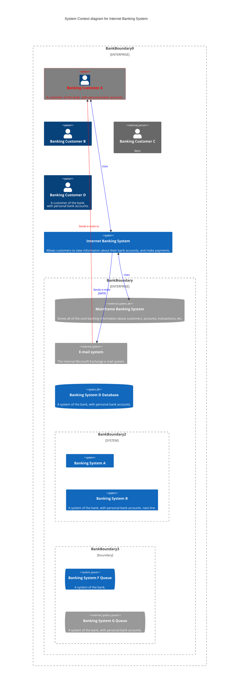

# RetroLyzer
FPGA Board that allows hacking of a MC68000P10 plus a 48-Bit LogicAnalyzer

The orginal idea was to build a logicanalyzer and as I came across some retro computing and remembered the fun I had with 68K CPUs I extend the original design by a sockel for a MC68000P10 64 DIP. 

The goal is to add bus transceivers for level shifting of the 5V TTL world to the 3.3V LVTTL world that the Spartan 6 can handle. I also add a 512K * 16 Bit SRAM which gets routed through the FPGA and the bus transceivers. 

