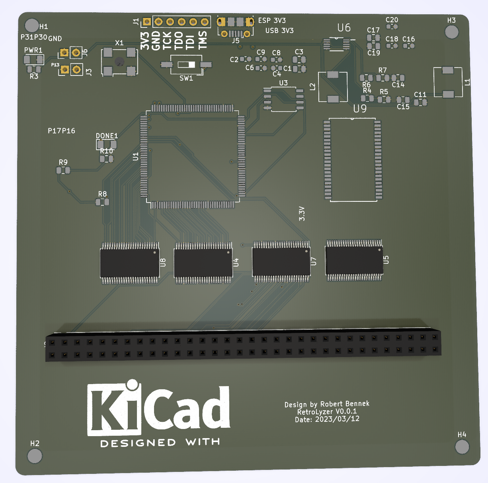

# RetroLyzer
FPGA Board for a 64-Bit LogicAnalyzer plus a board that allows hacking of a MC68000P10 by plugging it into the logic analyzer board. Thus other Retro CPUs can be hacked :-)

The orginal idea was to build a logicanalyzer and as I came across some retro computing and remembered the fun I had with 68K CPUs I extended the original design by a socket for a MC68000P10 64 DIP. 

The goal is to add bus transceivers for level shifting of the 5V TTL world to the 3.3V LVTTL world that the Spartan 6 can handle. I also add a 512K * 16 Bit SRAM which gets routed through the FPGA and the bus transceivers. 

plus 

using 

resulting into something like this 

# LogicAnalyzer Board

[LogicAnalyzer Details](kicad/logicanalyzer/README.md)

# Retro MC68k-HackingBoard

[MC68000P10 Details](kicad/mc68000board/README.md)

stay tuned .. more to come :-)